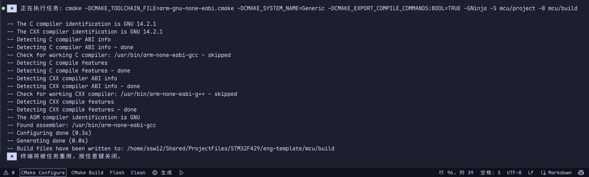
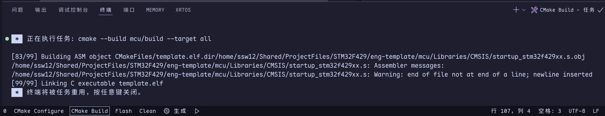
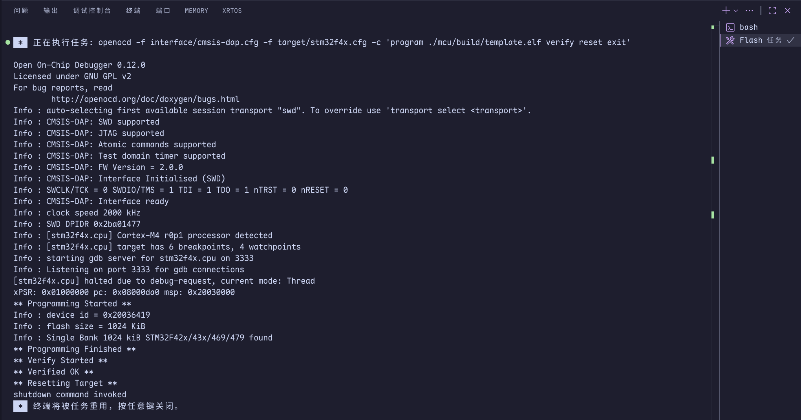

# STM32F429IGT6 标准开发库模板工程

## 简介

本项目是 **STM32F429IGT6** 在 vscode + CMake + Ninja + arm-gcc + OpenOCD + clangd 开发环境下的标准库开发模板工程项目。

本项目主要学习资料为B站视频，视频连接如下

```URL
https://www.bilibili.com/video/BV1svm1YYEQR?spm_id_from=333.788.recommend_more_video.0&trackid=web_related_0.router-related-2206146-n6d7k.1760876893572.594&vd_source=7f367bac1418ebc7806229fa33887aad
```

## 模板结构

当前模板工程的根目录结构如下：

```
根目录
.
├── .vscode             // vscode 配置文件夹
├── doc                 // 项目文档
├── mcu                 // 项目代码
└── README.md           // 项目自述文件
```

**1. vscode配置文件夹**
   ```
   .
   ├── settings.json        // vscode 关于本项目的设置
   └── tasks.json           // tasks 的配置文件
   ```

   - 通常情况本文件夹不需要参与项目中，实际上本文件夹也不会参与本项目开发与构建。但是其中一些配置有一定的实际用途，所以在本项目中添加了该文件夹。
  
   - settings.json 是 vscode 中关于该 workspace 的配置文件。 vscode 打开一个文件夹后会将该文件夹视为一个 工作空间(workspace)，不同 workspace 共用一个相同的 user settings 的配置，而 workspace 里的 settings.json 中的配置会覆盖公共配置，实现 vscode 的配置隔离。
   - tasks.json 是 用来定义该 workspace 中的 tasks 的。tasks 可以将一段指令封装进左下角的一个按钮里。在本工程的开发环境里，所有的编译，烧录都是在终端里输入指令实现的，而 tasks 可以将具体的指令封装为一个个按钮，简化开发过程。


**2. doc 文件夹**
   
   - 用来存储本项目的各种资料文件。

**3. mcu 文件夹**

```Tree
.
├── bsp                          // 存储片上外设的源文件与头文件
├── Libraries       // 存储所有库文件
│   ├── CMSIS                    // 存储核心库文件、启动文件等
│   ├── HAL_Driver               // 存储HAL库文件
│   └── ld                       // 存储链接文件
├── project         // 存储项目构建文件           
│   ├── arm-gnu-none-eabi.cmake  // 指定项目运行环境
│   └── CMakeLists.txt           // 指定项目结构
└── user            // 用户文件
    ├── main.c                   // 主文件
    ├── main.h                   // 我用来定义全局结构体
    ├── stm32f4xx_it.c           // 存储中断函数定义
    └── stm32f4xx_it.h           // 存储中断函数声明
```

具体文件说明请见 [文件说明.md](./doc/README/模板搭建教程.md) 文件

## 模板搭建教程

目前已经迁移到 [模板搭建教程.md](./doc/README/模板搭建教程.md) 文件中

## 模板使用教程

### 一、准备工作

1. 确保在终端中输入：
```bash
code --version
cmake --version
ninja --version
arm-none-eabi-gcc --version
arm-none-eabi-gdb --version
openocd --version
clang --version
llvm-config --version
```
均可以成功显示每个版本号信息。如果不行，请移步 [模板搭建教程](#模板搭建教程) 安装对应软件

2. 确保vscode中已安装如下插件：


1. 删除模板文件夹中的 doc、.git、README.md 等内容并重新建立。

### 二、工具介绍
此时使用 vscode 打开模板文件夹，可以看到 vscode 底栏有如下四个按键：


- **CMake Configure:** 调用 Cmake 生成项目构建目录.
- **Cmake Build:** 通过 CMake 调用底层的构建工具（本模板使用 Ninja ）去编译、汇编、链接出目标文件和固件。
- **Flash:** 使用用 OpenOCD 工具把编译好的 .elf 固件烧录到开发板的 Flash 中，然后校验、复位并退出。
- **Clean:** 清除指令,删除 build 与 .cache 文件夹。当 CMake Configure 或 Cmake Build 没有通过时，请务必使用此按键清除构建目录！！！

### 三、使用流程

1. 写完一版代码后，先点击 **CMake Configure** 按键。
   一切正常的情况下，vscode终端会显示如下内容：

   

   同时 mcu 文件夹中出现一个新文件夹 build。
   >:waring: 注意：失败的构建也会产生一个 build 文件夹，请从终端信息里判断是否构建成功！！！

2. 点击 **CMake Build** 按钮。  
   一切正常的情况下，vscode的终端会显示如下内容：

   

   此刻，build 文件夹的根目录中，出现 **template.bin** 、**template.elf** 、**template.hex** 三个文件

   > :warning: 注意：build的过成很有可能产生大量报错，请保持耐心和冷静，逐个自行处理。其中有几个汇编文件的警告，本人目前无法处理。不过仍然可以成功生成固件。

3. 点击 **Flash** 按钮。
   一切正常的情况下，vscode的终端会显示如下内容：

   

   此刻，程序已经成功烧录到芯片里。