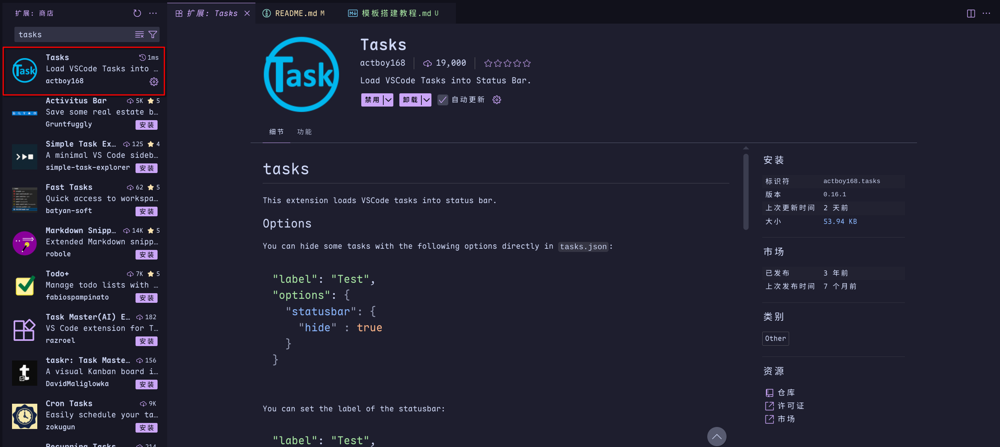
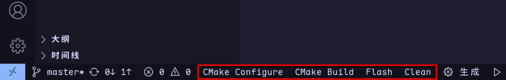
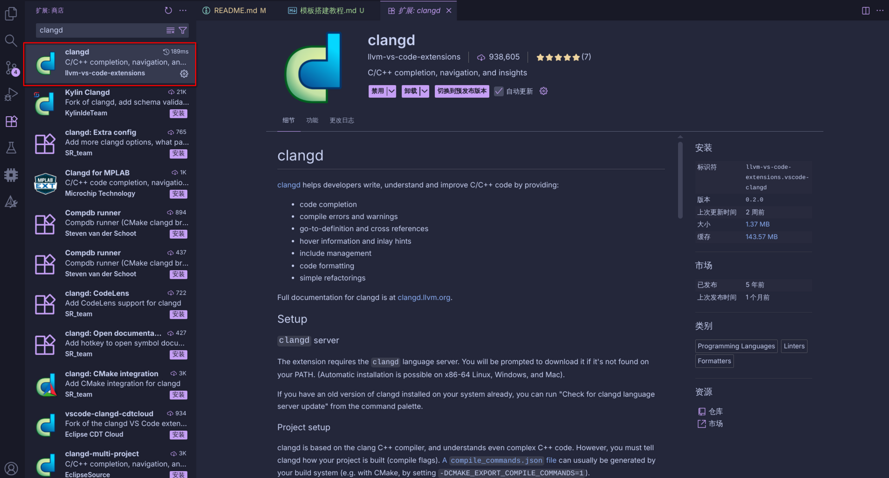
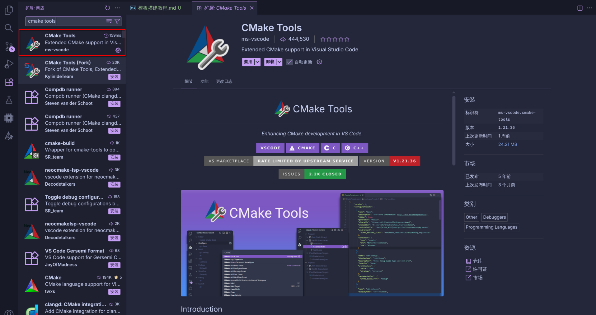

# 模板搭建教程

本文件会详细讲解该模板的搭建过程以及一些个人的理解。

## 一、安装软件

首先，需要安装以下软件

### 1. 安装 vscode

> vscode 是一款开源的、跨平台的代码编辑器。其本身并不具备代码编译、纠错等功能，但是提供了大量的插件以完成该目的。
  
   - **Windows**
      ```URL
      https://code.visualstudio.com/Download
      ```
      浏览器里输入以上网址，下载windows安装包并安装。

   - **Debian系**，apt/deb 包管理器
      ```bash
      sudo apt update

      sudo apt install wget gpg

      wget -qO- https://packages.microsoft.com/keys/microsoft.asc | sudo gpg --dearmor -o /usr/share/keyrings/packages.microsoft.gpg

      echo "deb [arch=amd64 signed-by=/usr/share/keyrings/packages.microsoft.gpg] https://packages.microsoft.com/repos/code stable main" | sudo tee /etc/apt/sources.list.d/vscode.list

      sudo apt update

      sudo apt install code
      ```
      依次在终端输入以上命令，即可完成安装。

   - **Arch系**，pacman包管理器
      ```bash
      sudo pacman -S code
      ```
      在终端输入以上命令，即可完成安装。

- 验证安装
```bash
code --version
```
终端输入以上指令，若输出了版本号等信息即为完成安装。

>:memo: **注意：** windows系统需要自行配置环境变量

### 2. 安装CMake
   
> CMake 是一个开源的、跨平台构建系统生成器（build system generator）。它本身不是编译器，也不直接编译代码，而是帮你生成“构建系统”。
   
> CMake 是建筑设计师，不是施工队。它画出一份蓝图（Makefile / Ninja file），告诉编译器该怎么干活。

CMake 通过读取 **CMakeLists.txt（项目配置）**、解析依赖、编译选项、目标文件、链接规则，最终生成一个给编译器使用的蓝图（本项目是build.ninja）文件。

   - windows
      ```URL
      https://cmake.org/download/
      ```
      浏览器里输入以上网址，下载 windows 版本的安装包并安装。

   - Debian系，apt/deb 包管理器
      ```bash
      sudo apt install cmake
      ```
      终端输入以上命令安装CMake。
      >:memo: **注意：** apt 安装的cmake版本大概率为 v3.28.3 左右的版本，而本项目使用 v4.1.2 版本完成构建。请确认版本是否具有差异。若有请自行升级或 **在 CMakeLists.txt 文件里更改版本号**

   - Arch系，pacman包管理器
      ```bash
      sudo pacman -S cmake
      ```
      在终端输入以上命令，即可完成安装。

- 验证安装
```bash
cmake --version
```
终端输入以上指令，若输出了版本号等信息即为完成安装。

>:memo: **注意：** windows系统需要自行配置环境变量

### 3. 安装ninja

> Ninja 是一个开源的、跨平台的、小而快（相较于Makefile）的构建系统执行器，用来根据依赖关系高效执行编译任务。

> Ninja 就像建筑施工队，它拿着 CMake 的蓝图（build.ninja）来盖房子（编译项目）。

Ninja 先读取并对比出 **build.ninja** 中哪些文件发生了变化，再按需进行执行编译、链接任务。最终生成二进制的目标程序。
   
   - windows中
      ```URL
      https://github.com/ninja-build/ninja/releases
      ```
      浏览器里输入以上网址，下载 windows 版本的压缩包并解压到软件目录。

   - Debian系，apt/deb 包管理器
      ```bash
      sudo apt install ninja-build
      ```
      终端输入以上命令安装。
   
   - Arch系，pacman包管理器
      ```bash
      sudo pacman -S ninja
      ```
      在终端输入以上命令，即可完成安装。

- 验证安装
```bash
ninja --version
```
终端输入以上指令，若输出了版本号等信息即为完成安装。

>:memo: **注意：** windows系统需要自行配置环境变量

4. 安装arm-gnu

> “arm-gnu” 实际上指的是一整套为 ARM 处理器编译代码的 GNU 工具链（GNU Toolchain for ARM）。它是由 ARM 官方 或 Linaro（ARM 生态公司） 发布和维护的开源的、跨平台的交叉编译器套件。

> 最后是“工人” —— 也就是编译器工具链。在 ARM 的世界里，这个工人叫 arm-none-eabi-gcc 或简称 arm-gnu。

这里使用的是 **arm-none-eabi-gcc**：
```
arm-none-eabi
│   │    └── eabi = Embedded Application Binary Interface（嵌入式ABI）
│   └────── none = 无操作系统（裸机环境）
└────────── arm = 目标架构
```  

   - windows
   ```URL
   https://developer.arm.com/downloads/-/arm-gnu-toolchain-downloads
   ```
      浏览器里输入以上网址，下载 windows 版本的压缩包并解压到软件目录。

   - Debian系，apt/deb 包管理器
      ```bash
      sudo apt install gcc-arm-none-eabi gdb-multiarch arm-none-eabi-gdb
      ```
      终端输入以上命令安装。
   
   - Arch系，pacman包管理器
      ```bash
      yay -S arm-gnu-toolchain-arm-none-eabi-bin
      ```
      在终端输入以上命令，即可完成安装。
      >:memo: **注意：** 请自行确保 yay 以及 aur 可以正常使用
   
- 验证安装
```bash
arm-none-eabi-gcc --version
arm-none-eabi-gdb --version
```
终端输入以上指令，若输出了版本号等信息即为完成安装。

>:memo: **注意：** windows系统需要自行配置环境变量

>:note: 其中，-gdb结尾的工具是用来实现debug功能的工具

### 5. 安装openOCD

> OpenOCD 是完全开源的、跨平台的 JTAG/SWD 调试器中枢软件。

> OpenOCD 就像一座“桥”，把电脑（GDB）和目标芯片（ARM Cortex-M、RISC-V 等）连接起来，实现在真实硬件上进行调试、烧录、单步执行、查看寄存器等操作。

   - windows
      ```URL
      https://gnutoolchains.com/arm-eabi/openocd/
      ```
      浏览器里输入以上网址，下载 windows 版本的压缩包并解压到软件目录。

   - Debian系，apt/deb 包管理器
      ```bash
      sudo apt install openocd
      ```
      终端输入以上命令安装。
   
   - Arch系，pacman包管理器
      ```bash
      sudo pacman -S openocd
      ```
      在终端输入以上命令，即可完成安装。
   
- 验证安装
```bash
openocd --version
```
终端输入以上指令，若输出了版本号等信息即为完成安装。

>:memo: **注意：** windows系统需要自行配置环境变量
   
### 6. 安装clang-llvm

> LLVM 是一整套开源的、跨平台的编译技术的建筑群。包括：优化器（把代码变快、变小）、中间表示（IR），类似一种“编译器的宇宙语言”、汇编器、链接器（lld）、目标代码生成器（ARM、X86、RISCV…）。其中 clang 就是站在 LLVM 上的 C/C++/Objective-C 前端。

> clang负责：解析 C/C++ 代码、检查语法、生成 LLVM IR、报错提示（非常人性化，远超 GCC）、提供静态分析工具、提供 clangd（给你写代码的智能提示）、静态分析器、JIT 引擎（可以即时生成机器码）。

本项目只是利用clang来做语法检查、报错提示以及代码只能提示。并不会使用LLVM以及clang的其他功能。
   
   - windows
      ```URL
      https://github.com/llvm/llvm-project/releases/
      ```
      浏览器里输入以上网址，下载 windows 版本的压缩包并解压到软件目录。
   
   - Debian系，apt/deb 包管理器
      ```bash
      sudo apt install clang llvm
      ```
      终端输入以上命令安装。

   - Arch系，pacman包管理器
      ```bash
      sudo pacman -S clang llvm
      ```
      在终端输入以上命令，即可完成安装。

- 验证安装
```bash
clang --version
llvm-config --version
```
终端输入以上指令，若输出了版本号等信息即为完成安装。

>:memo: **注意：** windows系统需要自行配置环境变量

## 二、vscode 插件安装

1. **Tasks**

   

   Tasks 可以将 `./.vscode/tasks.json` 中定义的指令在 vscode 的底栏中封装为一个按键。本模板一共封装了如下4个按键：

   

   各按键介绍参见 [Tasks说明](./Tasks说明)

2. **clangd**
   
   

   用于配合安装的 `clang` 软件，实现代码的智能补全与纠错。

3. **CMake Tools**
   
   

   用于在 vscode 中提供对 CMake 文件的代码提示与纠错功能。

4. **Cortex-Debug**
   
   

   用于在 vscode 中提供一套对代码的调试功能，其中阅读以及修改寄存器功能需要使用工具：arm-none-eabi-gdb。

## 三、项目编译过程

**以下内容由AI生成总结：**

整个流程像一支奇妙的“硅上交响乐”：每个角色分工明确，但必须协奏才能让你的固件最终在 MCU 上跳起来。

下面我给你总结整个链条如何串起来。

---

### 故事从你写代码开始

你敲代码时，如同一个作曲家。

IDE（VSCode、CLion…）背后调的是 **clangd**：

* 它读取 C/C++ 代码
* 理解头文件依赖
* 做语法分析
* 提供智能补全、静态分析、错误提示

但
**clangd 不参与真正的编译和烧录**。

它只是某种天才编辑，将你创造的乐曲美观、简洁的整理出来。

---

### 工程构建：CMake 和 Ninja 开始运转

你要真正构建固件时，依靠以下的链条：

```
CMake → Ninja → arm-none-eabi-gcc
```

它们分别扮演着各自的角色：

#### CMake

严格的设计大师。
它读取你的 CMakeLists.txt，理解你的乐曲：

* 有哪些源文件
* 目标 MCU 的型号
* 编译的选项
* 链接脚本
* 包含的路径

然后它生成一个 **Ninja 构建脚本（build.ninja）** ，告诉指挥家如何安排人员奏乐。

#### Ninja

超级强大的指挥大师。
它不懂 MCU，不懂 C。
它只知道：

* 哪些文件要编译
* 调哪个命令
* 先后依赖是什么

于是它挥动指挥棒，把每个源文件交给真正奏曲的演员：

#### arm-none-eabi-gcc

这才是演奏的演员，负责演出 MCU 能欣赏的音乐。
它：

* 编译 C/C++ 代码变成 `.o`
* 链接它们变成 `.elf`
* 用 objcopy 变成 `.bin` 或 `.hex`

这里才真正生成 MCU 能读的机器码。

---

### 构建结果：得到固件

最终你得到了：

* `project.elf`（带符号，用于调试）
* `project.hex`（用于烧录）

这就是烧写进入 MCU 的固件。 

---

### 接下来是调试/烧录：OpenOCD 登场

OpenOCD 是桥梁，是 MCU 可以欣赏乐曲的席位。

```
PC 上的软件  ↔  OpenOCD  ↔  JTAG/SWD 调试器  ↔  MCU
```

它的作用：

* 通过 USB 控制你的调试器（J-Link/ST-LINK/CMSIS-DAP）
* 让你可以 debug
* 让你可以烧录 bin/elf
* 提供 GDB Server 接口

如果你要烧录：

```bash
openocd -f interface/stlink.cfg -f target/stm32f4x.cfg \
    -c "program build/project.elf verify reset exit"
```

OpenOCD 把你的 `.elf` 转换成 Flash 操作命令，通过 SWD/JTAG 写进 MCU 的闪存。

---

### 最终：你的 firmware 在 MCU 上跑起来

流程就此完成。

你写的代码  
↓  
clangd 给你智能提示  
↓  
CMake 生成构建描述  
↓  
Ninja 按描述执行编译  
↓  
arm-none-eabi-gcc 生成最终固件  
↓  
OpenOCD 将固件烧进 MCU  
↓  
芯片开始执行你的程序

---

### 总结：

用 **clangd 提高开发体验**，
用 **CMake + Ninja 管理构建**，
用 **arm-none-eabi-gcc 完成真正编译**，
用 **OpenOCD 把成果送进硬件世界**。

整套工具链就像链式反应，环环相扣。

