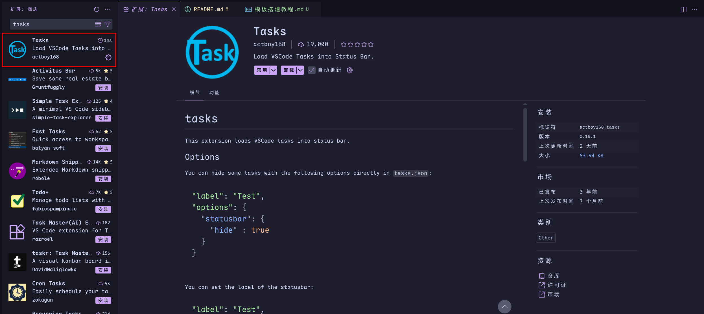
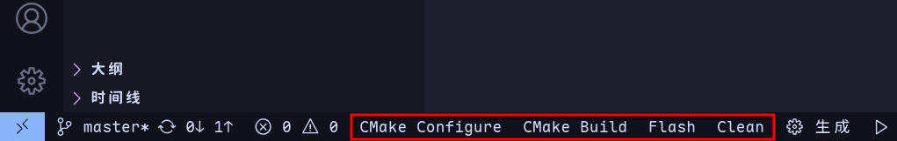
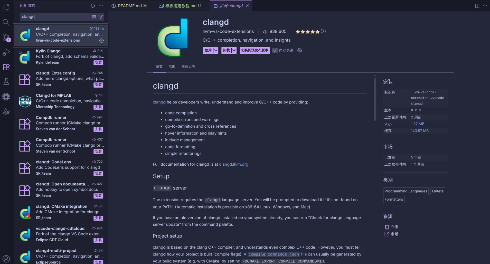
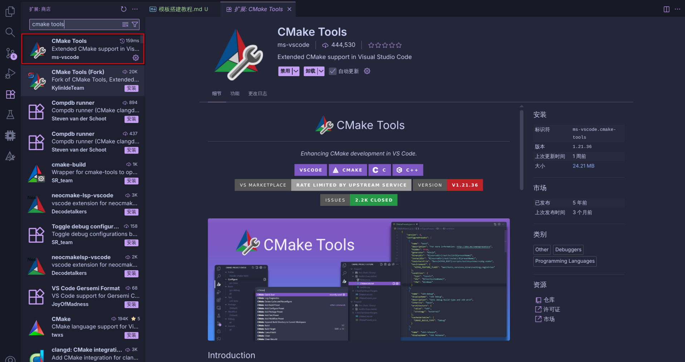
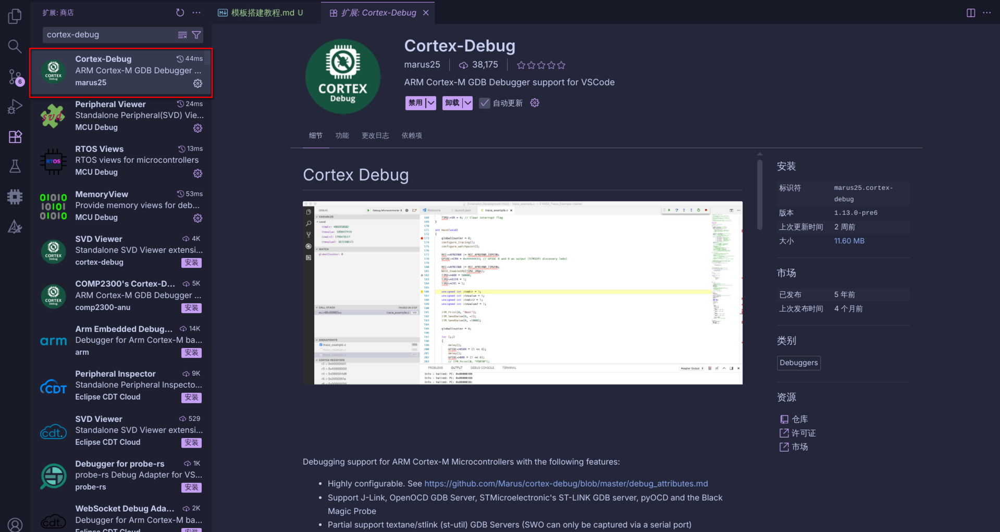

# 开发环境搭建教程

与传统的主流开发工具 `Arm-MDK` 这类集成开发环境(IDE) 不同，本套工程需要自己构建自己的开发环境。构建自己的开发环境说穿了就两件事：

- 手动安装开发需要用到的各种工具软件

- 为这些软件设置系统的环境变量

## 一、安装软件

### 1.1 vscode

> vscode 是一款开源的、跨平台的代码编辑器。

事实上，本套工程完全可以在记事本中编辑，并在终端中编译烧录。但 vscode 可以提供大量优化开发体验的插件。因此本教程将vscode作为开发必备工具之一。

```URL
https://code.visualstudio.com/download
```

对于 `Windows` 、`MacOS`、`Debian`系 与 `RedHat`系 的操作系统，可以在以上的官方下载地址中下载对应版本的安装包并手动安装。

对于 `Arch`系 的操作系统，可以使用以下命令安装：

```bash
sudo pacman -S code
```

### 1.2 CMake

> CMake 是一个开源的、跨平台构建系统生成器（build system generator）。它本身不是编译器，也不直接编译代码，而是生成“构建系统”。

> CMake 是建筑设计师，不是施工队。它画出一份蓝图（Makefile / Ninja file），告诉编译器该怎么干活。

- 工作方式：
  CMake 通过读取 **CMakeLists.txt（项目配置）**、解析依赖、编译选项、目标文件、链接规则，最终生成一个给编译器使用的蓝图（本项目是build.ninja）文件。

```URL
https://cmake.org/download/
```

各操作系统均可在以上官方下载地址的 `Binary distributions:` 处找到下载方式

 ⚠️**注意：** 

1. 对于各种发行版的 `Linux` 系统，通常建议使用各自的包管理器进行安装，包管理器中的的版本通常对于该系统足够稳定，且可以自动注册系统环境变量。
2. 当前处理器架构通常为 `X86_64`(`x64`)，极少数为 `AArch64`(`arm64`) 请自行留意官网中安装包与个人电脑的处理器架构对应。

### 1.3 Ninja

> Ninja 是一个开源的、跨平台的、小而快（相较于Makefile）的构建系统执行器，用来根据依赖关系高效执行编译任务。

> Ninja 就像建筑施工队，它拿着 CMake 的蓝图（build.ninja）来盖房子（编译项目）。

- 工作方式：
  Ninja 先读取并对比出 **build.ninja** 中哪些文件发生了变化，再按需进行执行编译、链接任务。最终生成二进制的目标程序。

```URL
https://github.com/ninja-build/ninja/releases
```

各操作系统均可在以上官方 releases 中找到下载方式。

⚠️**注意：** 

1. 对于各种发行版的 `Linux` 系统，通常建议使用各自的包管理器进行安装，在不同发行版中 Ninja 的包名不同，有 `Ninja` 与 `ninja-build` 两种。

### 1.4 arm-gnu-toolchain

> “arm-gnu-toolchain” 实际上指的是一整套为 ARM 处理器编译代码的 GNU 工具链（GNU Toolchain for ARM）。它是由 ARM 官方 或 Linaro（ARM 生态公司） 发布和维护的开源的、跨平台的交叉编译器套件。

> 这也是最后的“工人” —— 编译器工具链。负责接最终搭起房子。
 
```URL
https://developer.arm.com/downloads/-/arm-gnu-toolchain-downloads
```

各操作系统均可以在以上的官方下载地址中找到下载方式。

⚠️**注意：** 

1. 当前(2026.2.26) `arm-gnu-toolchain` 的最新版本为 `15.2.Rel1` ，请查找安装包时忽略版本号中的差异。

2. 该界面中存在大量的、不同单片机类型、不同编译主机类型的 `arm-gnu-toolchain` 安装文件 。网页中各组安装文件的上方有两行标签，第一行标签为编译主机的处理器架构与系统，第二行标签为开发芯片的处理器架构与系统环境。

3. 本教程所能涉及到的开发芯片均为 “32位arm处理器裸机环境” 即 **AArch32 bare-metal target (arm-none-eabi)** 。请确保选择的下载链接上方的标签第二行为以上字样。

4. 对于不同处理器架构、不同系统。以 `x64` 的 `linux` 系统为例：

.png)

找到网页中的这一位置，并选择 `arm-gnu-toolchain-15.2.rel1-x86_64-arm-none-eabi.tar.xz` 下载。

对于 **主流的开发环境(x64 windows)** 来说：

.png)

找到网页中的这一位置，并选择 `arm-gnu-toolchain-15.2.rel1-mingw-w64-x86_64-arm-none-eabi.zip` 或 `arm-gnu-toolchain-15.2.rel1-mingw-w64-x86_64-arm-none-eabi.msi` 下载。

> 笔者推荐使用 `.msi`(Windows Installer) 文件。通常这一安装包可以自动配置系统环境变量。

### 1.5 openOCD

> OpenOCD 是完全开源的、跨平台的 JTAG/SWD 调试器中枢软件。

> OpenOCD 就像一座“桥”，把电脑（GDB）和目标芯片（ARM Cortex-M、RISC-V 等）连接起来，实现在真实硬件上进行调试、烧录、单步执行、查看寄存器等操作。

```URL
https://gnutoolchains.com/arm-eabi/openocd/
```

各大主流操作系统的包管理器中均有 `openocd` 的包，包名就是 `openocd` 对于 `windows` 系统，若未配置 `MSYS2` ，可以使用以上网站提供的压缩包进行安装。

## 二、环境变量


## 三、vscode 插件安装

1. **Tasks**

   

   Tasks 可以将 `./.vscode/tasks.json` 中定义的指令在 vscode 的底栏中封装为一个按键。本模板一共封装了如下4个按键：

   

   各按键介绍参见 [Tasks说明](./Tasks说明)

2. **clangd**
   
   

   用于配合安装的 `clang` 软件，实现代码的智能补全与纠错。

3. **CMake Tools**
   
   

   用于在 vscode 中提供对 CMake 文件的代码提示与纠错功能。

4. **Cortex-Debug**
   
   

   用于在 vscode 中提供一套对代码的调试功能，其中阅读以及修改寄存器功能需要使用工具：arm-none-eabi-gdb。

> 至此，已经完成了对于 `vscode中嵌入式` 开发环境的搭建。
